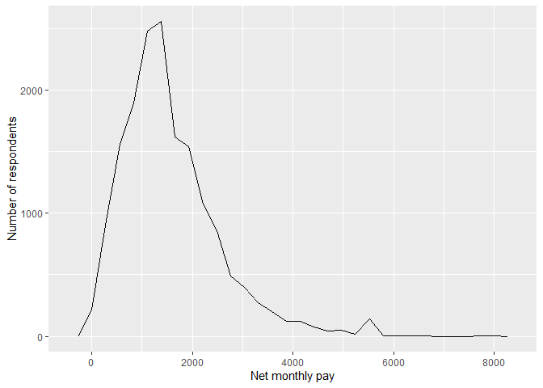
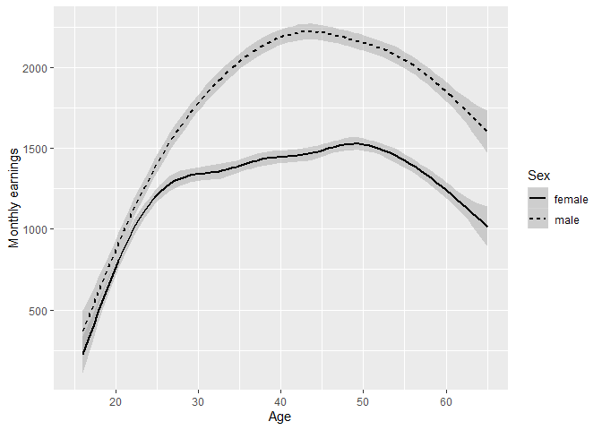
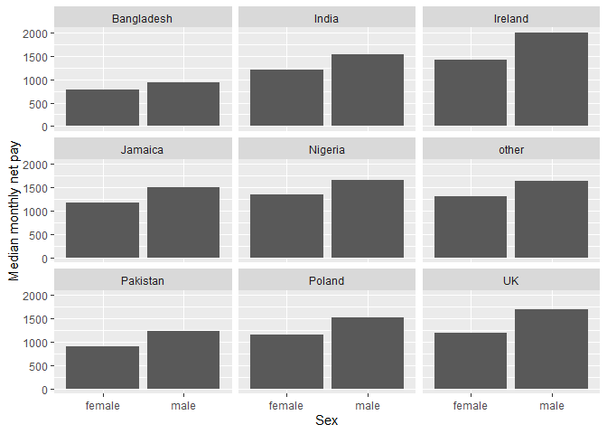
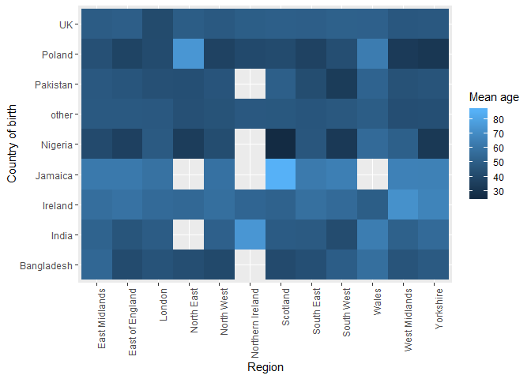
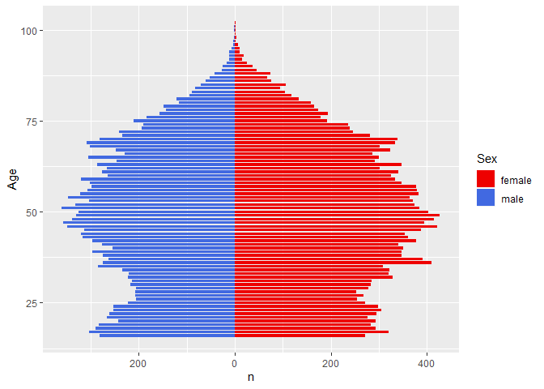

Statistical assignment 4
================
Olivia Hudson Candidate Number: 089369
26/02/2020

In this assignment you will need to reproduce 5 ggplot graphs. I supply
graphs as images; you need to write the ggplot2 code to reproduce them
and knit and submit a Markdown document with the reproduced graphs (as
well as your .Rmd file).

First we will need to open and recode the data. I supply the code for
this; you only need to change the file paths.

    ```r
    library(tidyverse)
    Data8 <- read_tsv("C:/Users/Liv/OneDrive - University of Exeter/Second Year/Term 2/POL2094 Data Analysis iii/Github/datan3/Data/6614tab_10EB1BA6123C0D95E60D28E156AEA8F7_V1/UKDA-6614-tab/tab/ukhls_w8/h_indresp.tab")
    Data8 <- Data8 %>%
        select(pidp, h_age_dv, h_payn_dv, h_gor_dv)
    Stable <- read_tsv("C:/Users/Liv/OneDrive - University of Exeter/Second Year/Term 2/POL2094 Data Analysis iii/Github/datan3/Data/6614tab_10EB1BA6123C0D95E60D28E156AEA8F7_V1/UKDA-6614-tab/tab/ukhls_wx/xwavedat.tab")
    Stable <- Stable %>%
        select(pidp, sex_dv, ukborn, plbornc)
    Data <- Data8 %>% left_join(Stable, "pidp")
    rm(Data8, Stable)
    Data <- Data %>%
        mutate(sex_dv = ifelse(sex_dv == 1, "male",
                           ifelse(sex_dv == 2, "female", NA))) %>%
        mutate(h_payn_dv = ifelse(h_payn_dv < 0, NA, h_payn_dv)) %>%
        mutate(h_gor_dv = recode(h_gor_dv,
                         `-9` = NA_character_,
                         `1` = "North East",
                         `2` = "North West",
                         `3` = "Yorkshire",
                         `4` = "East Midlands",
                         `5` = "West Midlands",
                         `6` = "East of England",
                         `7` = "London",
                         `8` = "South East",
                         `9` = "South West",
                         `10` = "Wales",
                         `11` = "Scotland",
                         `12` = "Northern Ireland")) %>%
        mutate(placeBorn = case_when(
                ukborn  == -9 ~ NA_character_,
                ukborn < 5 ~ "UK",
                plbornc == 5 ~ "Ireland",
                plbornc == 18 ~ "India",
                plbornc == 19 ~ "Pakistan",
                plbornc == 20 ~ "Bangladesh",
                plbornc == 10 ~ "Poland",
                plbornc == 27 ~ "Jamaica",
                plbornc == 24 ~ "Nigeria",
                TRUE ~ "other")
        )
    ```

Reproduce the following graphs as close as you can. For each graph,
write two sentences (not more\!) describing its main message.

1.  Univariate distribution (20 points).
    
    ``` r
      ggplot(data = Data, mapping = aes(x = h_payn_dv, )) +
      geom_freqpoly() +
      labs(x = "Net monthly pay", y = "Number of respondents")
    ```
    
    <!-- -->

The main message of this graph is: Most Respondents have a net monthly
pay of between 0 and 3000, with the most respondents (just over 2500)
earning a net monthly pay of around 1500 (as represented by the highest
peak of the graph). There is a small spike in respondents who earn
around 5500 a month, but the graph then plateaus between around 6000 and
8000 net monthly pay: showing that nearly no respondents earn this much.

2.  Line chart (20 points). The lines show the non-parametric
    association between age and monthly earnings for men and women.
    
    ``` r
    ggplot(data = Data) + 
      geom_smooth(color = "black", mapping = aes(x = h_age_dv, y = h_payn_dv, linetype = sex_dv)) +
      xlim(15,65) +
      labs(x = "Age", y = "Monthly earnings", linetype = "Sex")
    ```
    
    <!-- -->

The main message of this graph is: Monthly earnings tend to increase as
the age of the respondents increases, with those under 20 earning the
least (as they are just starting their careers) and those aged between
40-50 earning the most (as they are likely in the prime of their
careers), monthly earnings then decrease past the age of 50 (as people
begin to work less with age). Male respondents have consistently higher
monthly earnings than female respondents; this gap in earnings is small
for those under 25, but past the age of 25 this gap increases and
particularly between ages 40 - 45 male monthly earnings are
significantly higher than female monthly earnings (with nearly a 1000
difference in monthly earnings).

3.  Faceted bar chart (20 points).
    
    ``` r
    Data_barchart <- Data %>%
      na.omit() %>%
      group_by(placeBorn, sex_dv) %>%
      summarise(Median_h_payn_dv = median(h_payn_dv))
    
    ggplot(data=Data_barchart, aes(x = sex_dv, y= Median_h_payn_dv)) +
      geom_bar(stat="identity") +
      facet_wrap(~ placeBorn) +
      labs(x = "Sex", y = "Median monthly net pay")
    ```
    
    <!-- -->

The main message of this graph is: Male median monthly net pay is
consistently higher than that of females across all the countries in the
placeBorn variable. This pay gap is largest in Ireland (with a
difference in pay of around 500) and lowest in Bangladesh (with a
difference in pay of less than 250).

4.  Heat map (20 points).
    
    ``` r
    Data_heatmap <- Data %>%
      filter(!is.na(h_gor_dv)) %>%
      filter(!is.na(placeBorn)) %>%
      group_by(placeBorn, h_gor_dv) %>%
      summarise(Mean_h_age_dv = mean(h_age_dv))
    
      ggplot(data = Data_heatmap, aes(x = h_gor_dv, y = placeBorn)) +
      geom_tile(aes(fill = Mean_h_age_dv)) + 
      theme(axis.text.x = element_text(angle = 90, hjust = 1, vjust = 1)) +
      labs(fill = "Mean age", x = "Region", y = "Country of birth")
    ```
    
    <!-- -->

The main message of this graph is: The mean age of respondents born in
the UK is around 50. The mean age of those in the data born in the UK,
Poland, Pakistan, other and Nigeria is lower than the mean age of those
born in Jamaica, Ireland, India and Bangladesh.

5.  Population pyramid (20 points).

**NOTE: I have used scale\_y\_continous(labels = abs) so that the y axis
doesnt have negatives because Alexi said that there shouldnt be a
negative side even though it is shown in the original graph**

``` r
  Data_poppyramid <- Data %>%
      filter(!is.na(h_age_dv)) %>%
      filter(!is.na(sex_dv))
      
  ggplot(data=Data_poppyramid, aes(x= h_age_dv, fill= sex_dv)) + 
  geom_bar(data=subset(Data_poppyramid,sex_dv=="female"), width = 0.75) + 
  geom_bar(data=subset(Data_poppyramid,sex_dv=="male"), aes(y=..count..*(-1)), width = 0.75) + 
  scale_y_continuous(labels = abs) +
  coord_flip() +
  labs(fill = "Sex", y = "n", x = "Age") +
  scale_colour_manual(values = c("red2", "royalblue"),
                      aesthetics = c("color", "fill"))
```

<!-- -->

The main message of this graph is: There are more females than males in
the dataframe. Most people in the dataframe, regardless of sex are aged
around 50.
